# Functional Diagrams for JLPT N5–N1 System

Tài liệu này chứa các sơ đồ Mermaid (Activity + Sequence) cho từng chức năng đã yêu cầu. Dùng để vẽ trực tiếp hoặc dán vào các công cụ hỗ trợ Mermaid.

## 1. Authentication Functions

### 1.1 Registration (Activity)
```mermaid
flowchart TD
  A[User enters email/password/displayName] --> B[Validate input]
  B --> |invalid| C[Show validation error]
  B --> |valid| D[Check existing email via GET /api/users?email=]
  D --> |exists| E[Return 409 Email exists]
  D --> |not exists| F[Hash password (bcrypt)]
  F --> G[Create user record in users]
  G --> H[Generate JWT token]
  H --> I[Return 201 {user, token}]
```

### 1.1 Registration (Sequence)
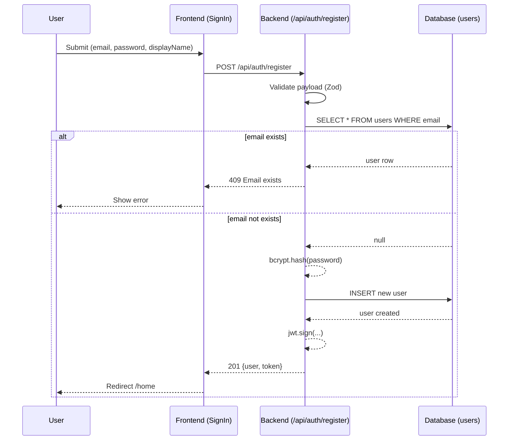

### 1.2 Login (Activity)
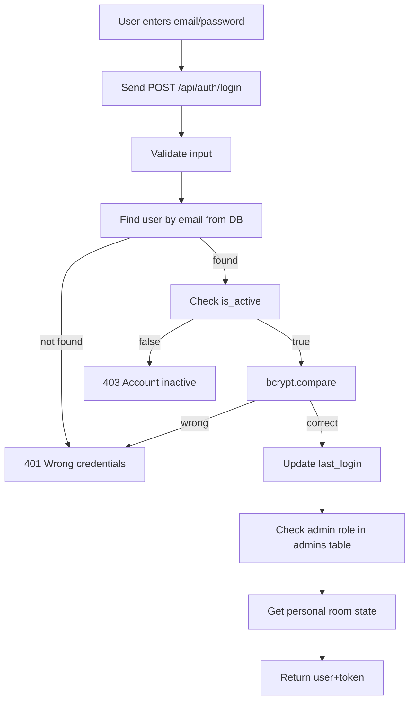

### 1.2 Login (Sequence)
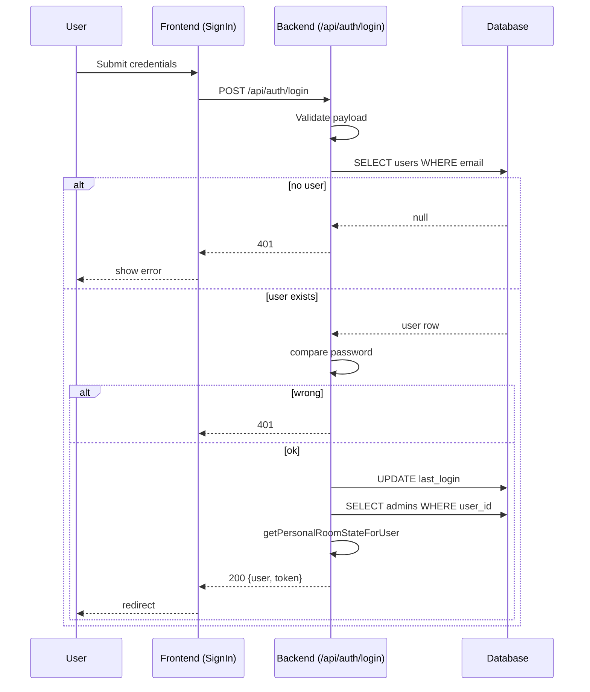

### 1.3 Logout (Activity)
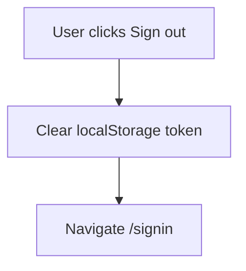

### 1.3 Logout (Sequence)
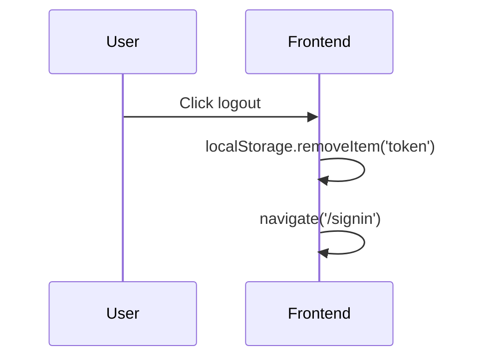

### 1.4 Forgot Password (Activity)
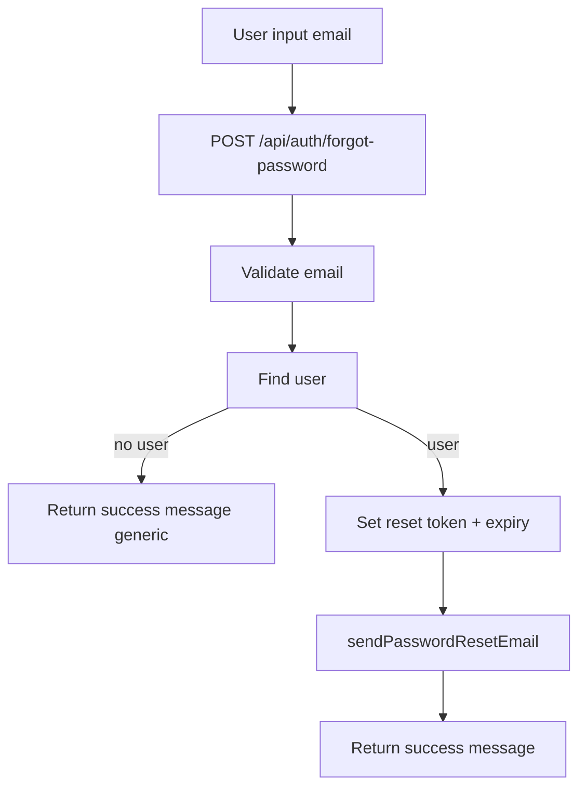

### 1.4 Forgot Password (Sequence)
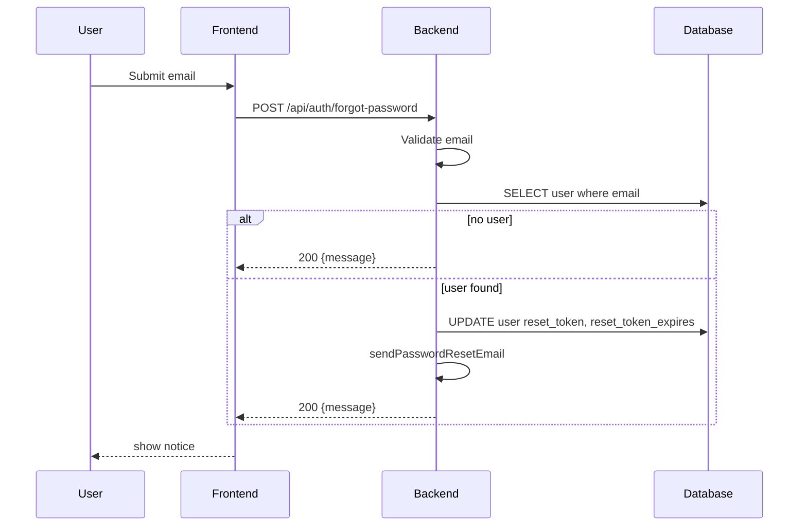

### 1.5 Reset Password (Activity)
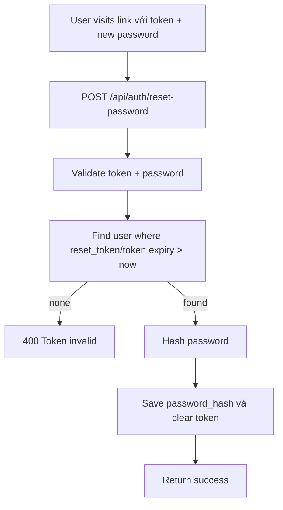

### 1.5 Reset Password (Sequence)
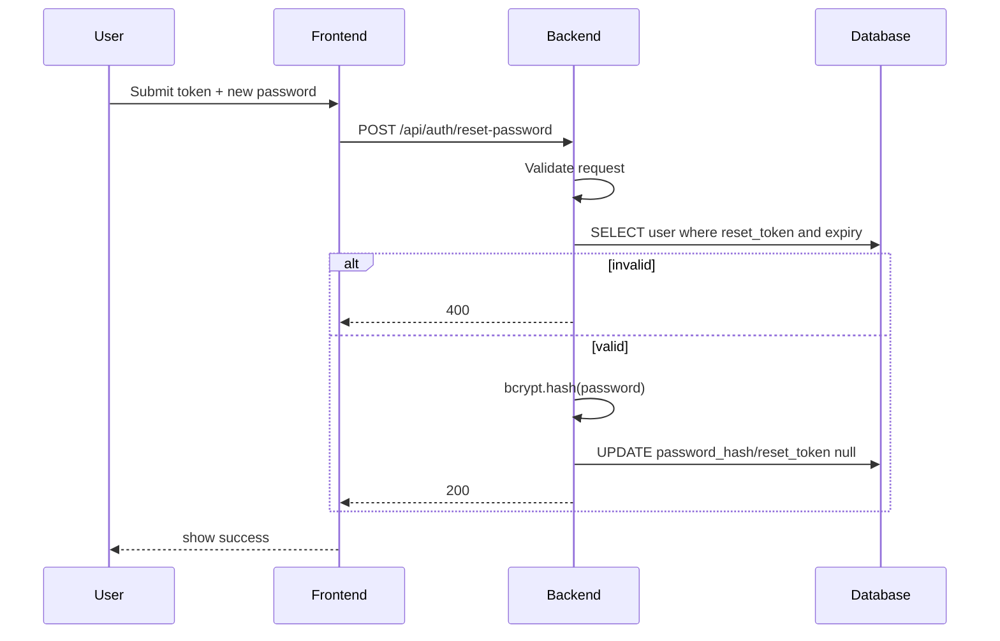

## 2. Learning Functions

### 2.1 Reading Practice
#### Activity
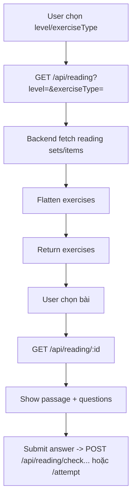

#### Sequence
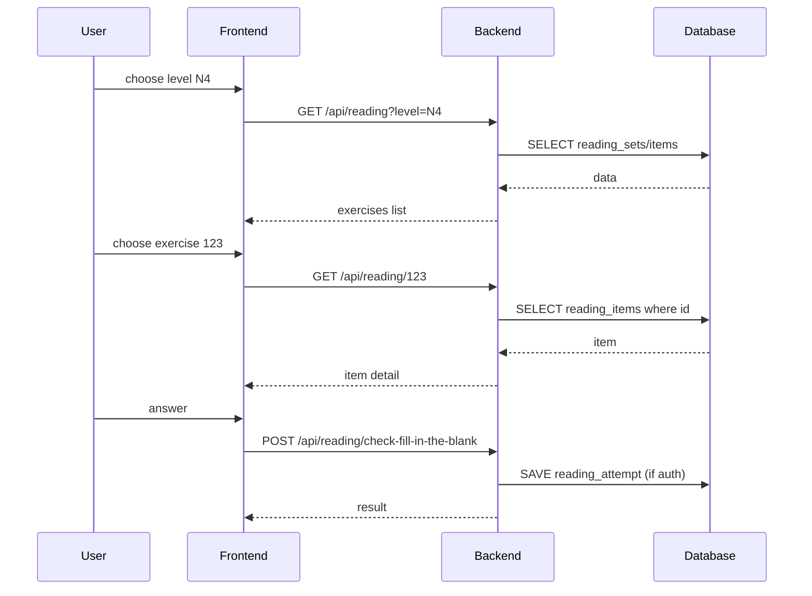

### 2.2 Listening Practice
#### Activity
```mermaid
flowchart TD
  A[User chọn level] --> B[GET /api/listening?level=]
  B --> C[API trả item+audio]
  C --> D[Play audio (frontend control)]
  D --> E[Submit MCQ/caption/raw text]
  E --> F[POST /api/listening/attempt hoặc /check-dictation]
  F --> G[Return score]
  G --> H[Optional: GET /api/listening/review (auth)]
```

#### Sequence
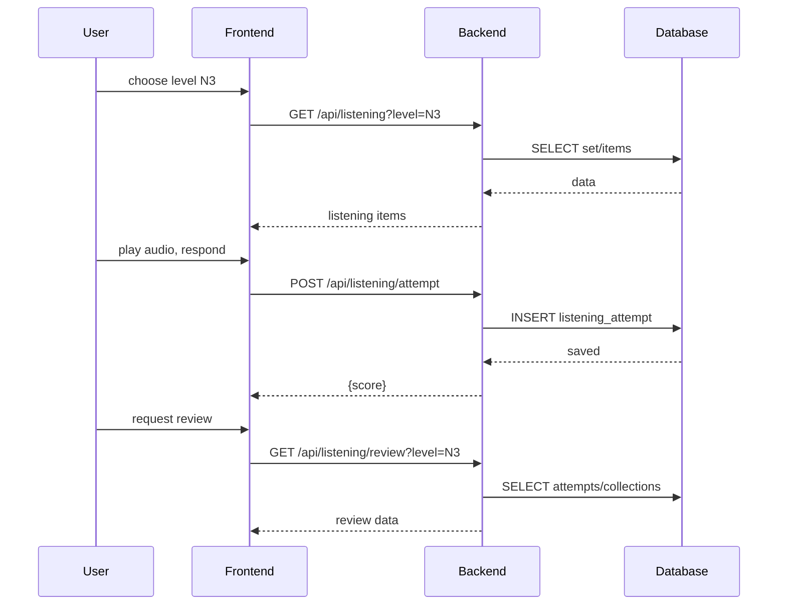

### 2.3 Speaking Practice
#### Activity
```mermaid
flowchart TD
  A[User chọn phrase level/topic] --> B[GET /api/speaking/phrases]
  B --> C[Show phrase list]
  C --> D[Option generate audio / practice]
  D --> |generate| E[POST /api/speaking/phrases/:id/generate-audio]
  D --> |practice| F[user ghi âm/audio file]
  F --> G[POST /api/speaking/practice (multipart)]
  G --> H[Service xử lý STT + đánh giá]
  H --> I[Save speaking_attempt]
  I --> J[Trả feedback+score]
```

#### Sequence
```mermaid
sequenceDiagram
  participant U as User
  participant F as Frontend
  participant B as Backend
  participant DB as Database

  U->>F: request phrases
  F->>B: GET /api/speaking/phrases
  B->>DB: SELECT phrases
  B-->>F: list
  U->>F: select phrase 42
  F->>B: POST /api/speaking/phrases/42/generate-audio
  B-->>F: audio file link
  U->>F: upload recording
  F->>B: POST /api/speaking/practice (audio)
  B->>B: process audio; STT & scoring
  B->>DB: INSERT speaking_attempt
  DB-->>B: saved
  B-->>F: score
```

### 2.4 Chatbot AI
#### Activity
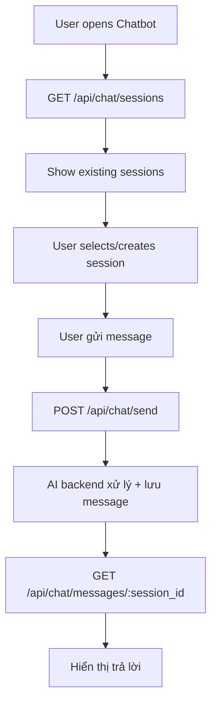

#### Sequence
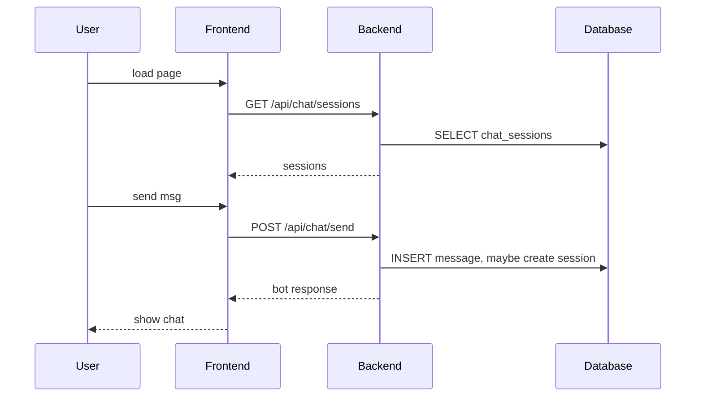

## 3. Administrator / Management Functions

### 3.1 User Management
#### Sequence
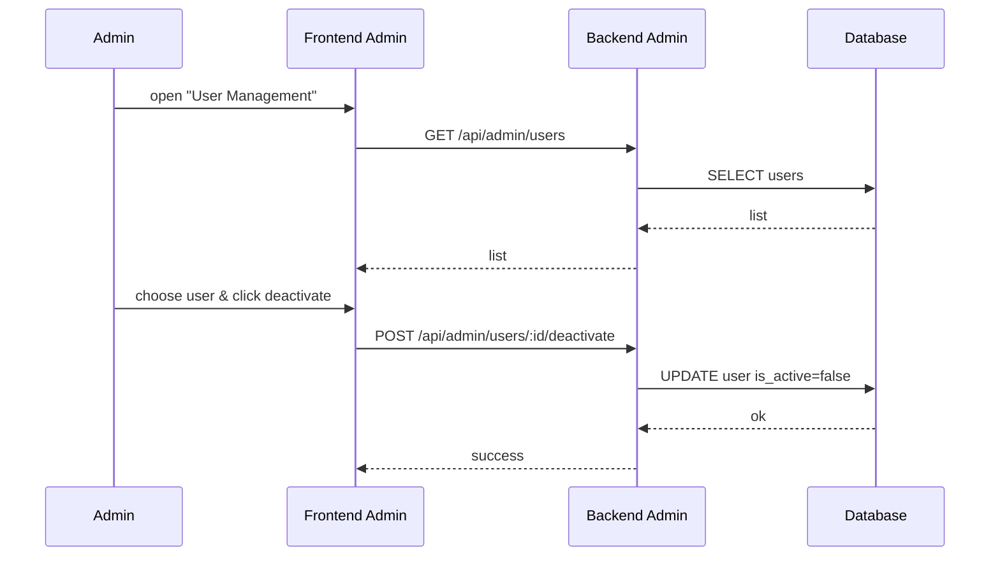

### 3.2 Admin Management
#### Sequence
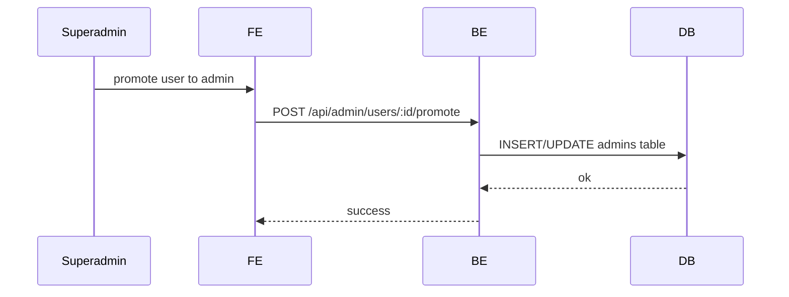

### 3.3 Reading/Listening/Speaking Content Management
#### Activity
```mermaid
flowchart TD
  A[Admin mở module quản lý Reading/Listening/Speaking] --> B[GET /api/admin/<type>/sets or /phrases]
  B --> C[Hiện danh sách]
  C --> D[Add/Edit/Delete]
  D --> |Add| E[POST /api/admin/..]
  D --> |Edit| F[PUT/PATCH /api/admin/..]
  D --> |Delete| G[DELETE /api/admin/..]
  E/F/G --> H[DB cập nhật (insert/update/delete)]
  H --> I[BE trả về success]
```

### 3.4 Admin Audit Log
#### Activity
```mermaid
flowchart TD
  A[Admin mở Audit Log] --> B[GET /api/admin/audit]
  B --> C[Return operations list]
  C --> D[Hiển thị filter/chi tiết]
```

#### Sequence
```mermaid
sequenceDiagram
  participant Admin
  participant FE
  participant BE
  participant DB

  Admin->>FE: Request audit history
  FE->>BE: GET /api/admin/audit
  BE->>DB: SELECT admin_audit
  DB-->>BE: records
  BE-->>FE: records
  FE-->>Admin: display
```
