# Mermaid Diagrams for Japanese Learning AI App

This document contains Usecase, Sequence, and Activity diagrams drawn with Mermaid.js for the main functions of the application.

## Table of Contents
1.  [User Authentication Features](#1-user-authentication-features)
    *   [Login](#login)
    *   [Register](#register)
    *   [Logout](#logout)
    *   [Forgot Password](#forgot-password)
2.  [Learning Features](#2-learning-features)
    *   [Reading Practice](#reading-practice)
    *   [Listening Practice](#listening-practice)
    *   [Speaking Practice](#speaking-practice)
    *   [Chatbot AI](#chatbot-ai)
3.  [Admin Management Features](#3-admin-management-features)
    *   [User Management](#user-management)
    *   [Admin Management](#admin-management)
    *   [Reading Management](#reading-management)
    *   [Listening Management](#listening-management)
    *   [Speaking Management](#speaking-management)
    *   [Admin Log](#admin-log)

---

## 1. User Authentication Features

### Login

#### Usecase Diagram
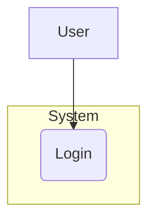

#### Sequence Diagram
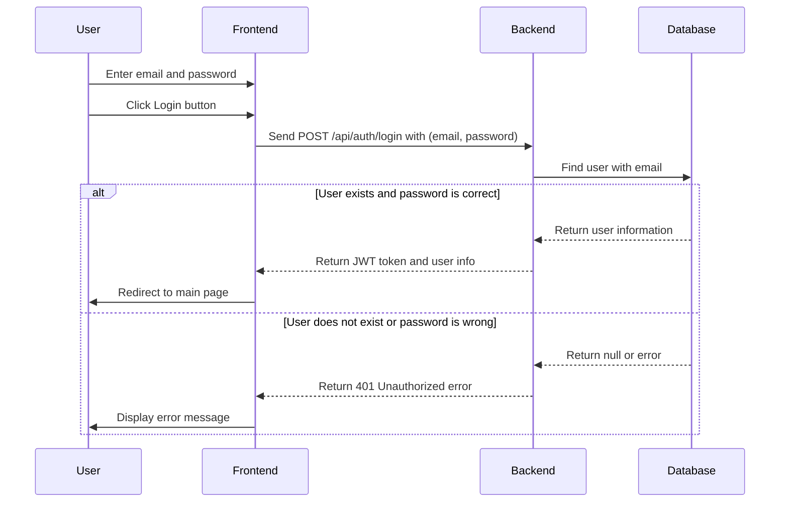

#### Activity Diagram
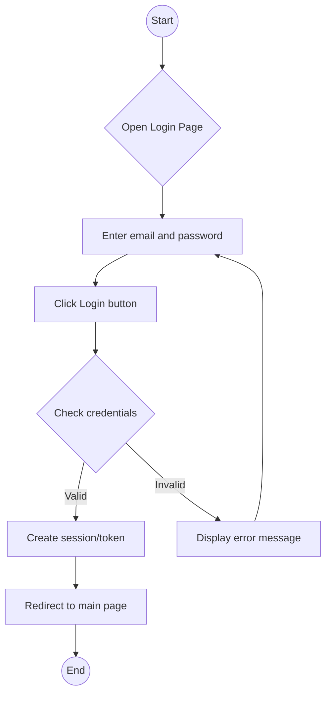

### Register

#### Usecase Diagram
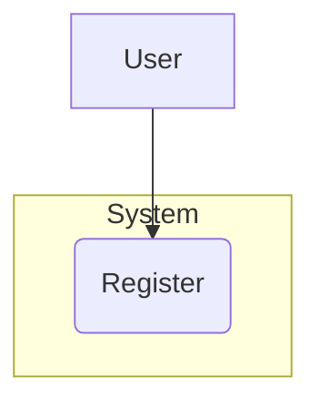

#### Sequence Diagram
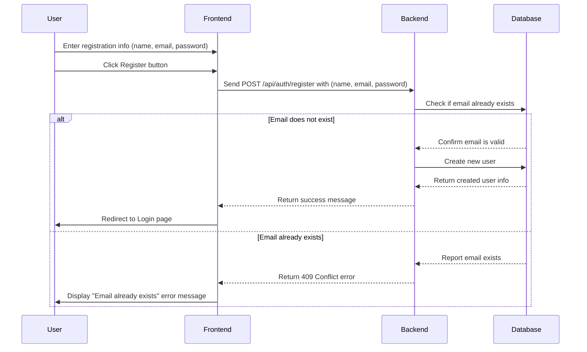

#### Activity Diagram
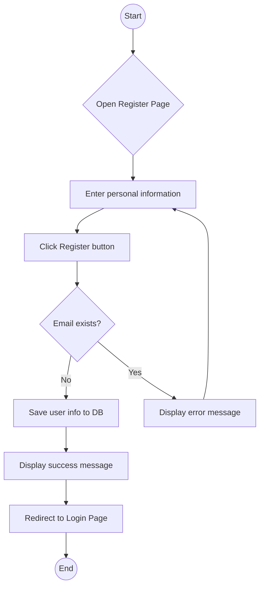

### Logout

#### Usecase Diagram
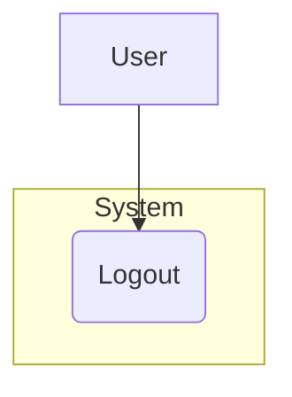

#### Sequence Diagram
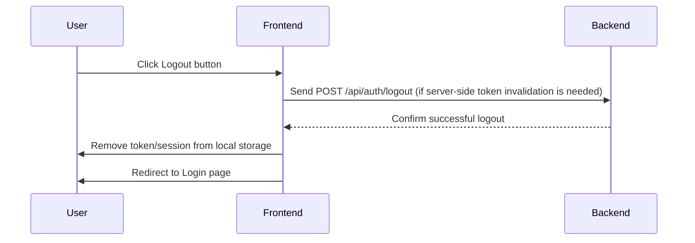

#### Activity Diagram
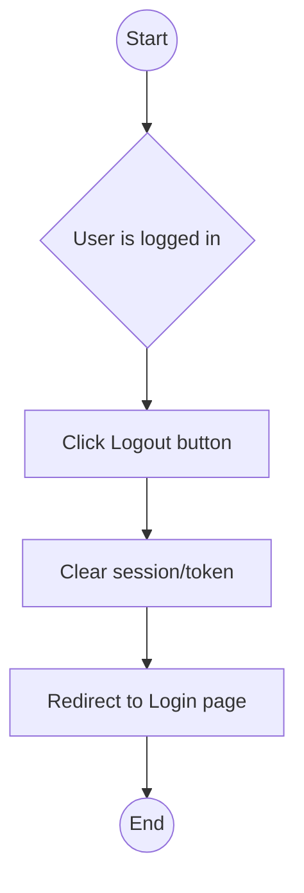

### Forgot Password

#### Usecase Diagram
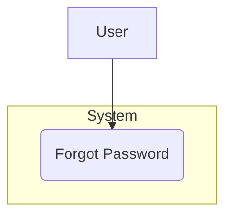

#### Sequence Diagram
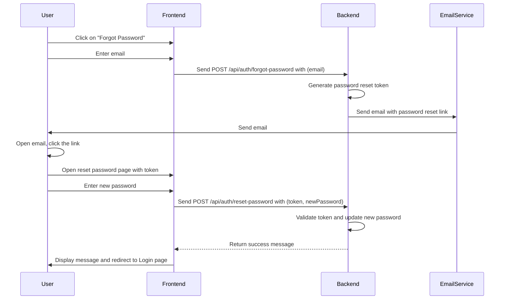

#### Activity Diagram
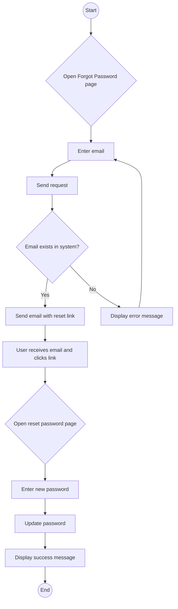

---

## 2. Learning Features

### Reading Practice

#### Usecase Diagram
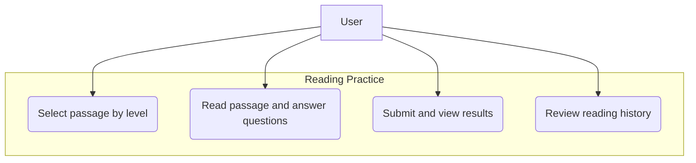

#### Sequence Diagram
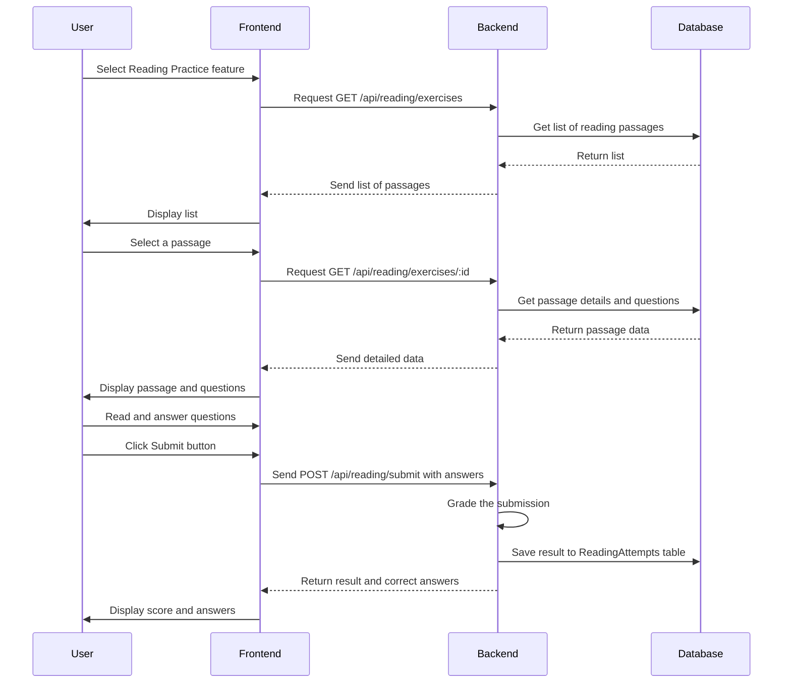

#### Activity Diagram
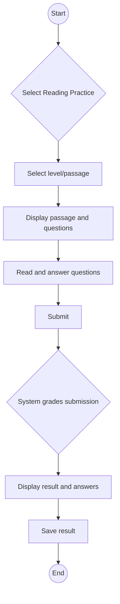

### Listening Practice

#### Usecase Diagram
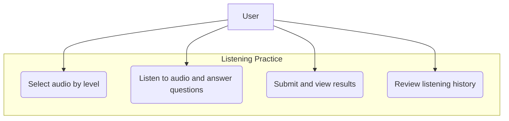

#### Sequence Diagram
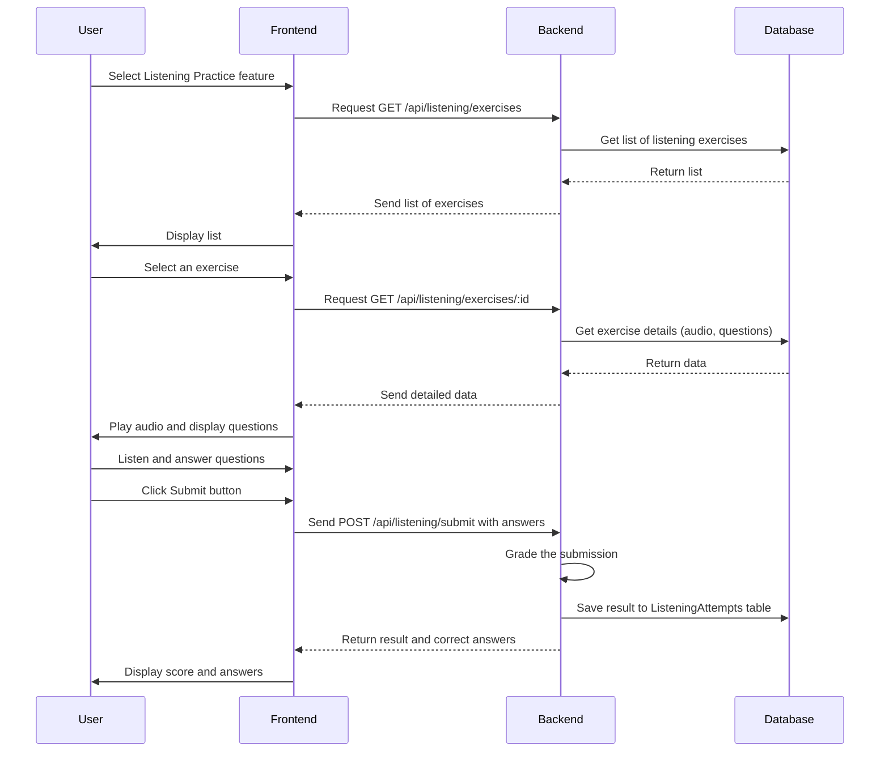

#### Activity Diagram
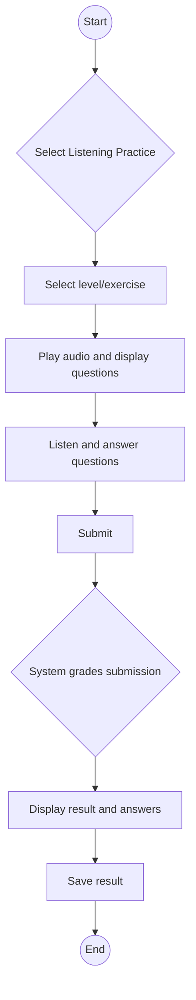

### Speaking Practice

#### Usecase Diagram
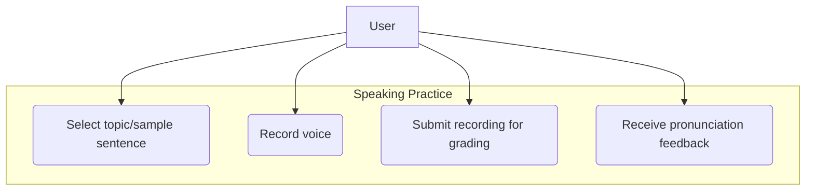

#### Sequence Diagram
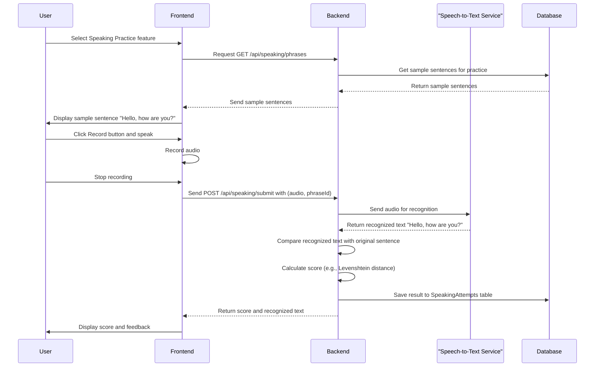

#### Activity Diagram
```mermaid
graph TD
    Start((Start)) --> B{Select Speaking Practice};
    B --> C[Select sample sentence];
    C --> D[Display sample sentence];
    D --> E[Start recording];
    E --> F[Speak the sentence];
    F --> G[Stop recording];
    G --> H[Upload audio to server];
    H --> I{Server converts speech to text};
    I --> J{Compare with sample & grade};
    J --> K[Display result and feedback];
    K --> L[Save result];
    L --> End((End));
```

### Chatbot AI

#### Usecase Diagram
```mermaid
graph TD
    User["User"]
    subgraph "Chatbot"
        UC_C1("Send message to AI")
        UC_C2("Receive response from AI")
        UC_C3("Review conversation history")
    end
    User --> UC_C1
    User --> UC_C2
    User --> UC_C3
```

#### Sequence Diagram
```mermaid
sequenceDiagram
    participant User
    participant Frontend
    participant Backend
    participant NLPService as "NLP Service (e.g., Gemini)"

    User->>Frontend: Open Chatbot interface
    User->>Frontend: Type message "Hello"
    Frontend->>Backend: Send POST /api/chat with (message)
    Backend->>NLPService: Send user's message
    NLPService-->>Backend: Return response "Hello! How are you?"
    Backend-->>Frontend: Send back AI's response
    Frontend->>User: Display AI's response
```

#### Activity Diagram
```mermaid
graph TD
    Start((Start)) --> B{Open Chat Window};
    B --> C[Type message];
    C --> D[Send message];
    D --> E{System sends message to AI};
    E --> F{AI processes and generates response};
    F --> G[Display AI response];
    G --> C;
```

---

## 3. Admin Management Features

### User Management

#### Usecase Diagram
```mermaid
graph TD
    Admin["Admin"]
    subgraph "User Management"
        UC_UM1("View user list")
        UC_UM2("View user details")
        UC_UM3("Edit user information")
        UC_UM4("Delete user")
    end
    Admin --> UC_UM1
    Admin --> UC_UM2
    Admin --> UC_UM3
    Admin --> UC_UM4
```

#### Sequence Diagram (Example: Delete User)
```mermaid
sequenceDiagram
    participant Admin
    participant Frontend
    participant Backend
    participant Database

    Admin->>Frontend: Access User Management page
    Frontend->>Backend: Request GET /api/admin/users
    Backend->>Database: Get user list
    Database-->>Backend: Return list
    Backend-->>Frontend: Send user list
    Admin->>Frontend: Click Delete button for a user
    Frontend->>Backend: Send DELETE /api/admin/users/:id
    Backend->>Database: Delete user with corresponding id
    note right of Backend: Log action to Admin Audit Log
    Database-->>Backend: Confirm successful deletion
    Backend-->>Frontend: Return success message
    Frontend->>Frontend: Refresh user list on UI
    Frontend->>Admin: Display "Deletion successful" message
```

#### Activity Diagram
```mermaid
graph TD
    Start((Start)) --> B{Admin logs in};
    B --> C[Navigate to User Management page];
    C --> D[Display user list];
    D --> E{Select action};
    E -- View --> F[Display user details] --> D;
    E -- Edit --> G[Open edit form];
    G --> H[Save changes];
    H --> I{Update in DB} --> D;
    E -- Delete --> J[Confirm deletion];
    J --> K{Delete from DB} --> D;
    E -- Exit --> End((End));
```

### Admin Management

#### Usecase Diagram
```mermaid
graph TD
    SuperAdmin["Super Admin"]
    subgraph "Admin Management"
        UC_AM1("View Admin list")
        UC_AM2("Add new Admin")
        UC_AM3("Revoke Admin rights")
    end
    SuperAdmin --> UC_AM1
    SuperAdmin --> UC_AM2
    SuperAdmin --> UC_AM3
```

### Reading Management

#### Usecase Diagram
```mermaid
graph TD
    Admin["Admin"]
    subgraph "Reading Management"
        UC_RM1("View passage list")
        UC_RM2("Add new passage")
        UC_RM3("Edit passage")
        UC_RM4("Delete passage")
        UC_RM5("Add/Edit/Delete questions for passage")
    end
    Admin --> UC_RM1
    Admin --> UC_RM2
    Admin --> UC_RM3
    Admin --> UC_RM4
    Admin --> UC_RM5
```

### Listening Management

#### Usecase Diagram
```mermaid
graph TD
    Admin["Admin"]
    subgraph "Listening Management"
        UC_LM1("View exercise list")
        UC_LM2("Add new exercise (upload audio)")
        UC_LM3("Edit exercise")
        UC_LM4("Delete exercise")
        UC_LM5("Add/Edit/Delete questions for exercise")
    end
    Admin --> UC_LM1
    Admin --> UC_LM2
    Admin --> UC_LM3
    Admin --> UC_LM4
    Admin --> UC_LM5
```

### Speaking Management

#### Usecase Diagram
```mermaid
graph TD
    Admin["Admin"]
    subgraph "Speaking Management"
        UC_SM1("View sample sentence list")
        UC_SM2("Add new sample sentence")
        UC_SM3("Edit sample sentence")
        UC_SM4("Delete sample sentence")
        UC_SM5("Listen to standard audio of sentence")
    end
    Admin --> UC_SM1
    Admin --> UC_SM2
    Admin --> UC_SM3
    Admin --> UC_SM4
    Admin --> UC_SM5
```

### Admin Log

#### Usecase Diagram
```mermaid
graph TD
    Admin["Admin"]
    subgraph "Admin Log"
        UC_AL1("View action history")
        UC_AL2("Filter history by Admin or action")
    end
    Admin --> UC_AL1
    Admin --> UC_AL2
```

#### Sequence Diagram (View Log)
```mermaid
sequenceDiagram
    participant Admin
    participant Frontend
    participant Backend
    participant AdminAuditService
    participant Database

    %% Context: Another Admin action occurred previously %%
    Admin->>Frontend: Perform action (e.g., Delete User)
    Frontend->>Backend: Send DELETE /api/admin/users/:id request
    Backend->>AdminAuditService: Log action (logAction)
    AdminAuditService->>Database: Save log to AdminAuditLog table

    %% View Log Functionality %%
    Admin->>Frontend: Access Admin Log page
    Frontend->>Backend: Request GET /api/admin/audit-logs
    Backend->>Database: Get log list from AdminAuditLog table
    Database-->>Backend: Return log list
    Backend-->>Frontend: Send log list
    Frontend->>Admin: Display action history table
```

#### Activity Diagram
```mermaid
graph TD
    subgraph "Admin Action (any)"
        A((Start action)) --> B[Perform data modification]
        B --> C{Log action in Audit Log Table}
        C --> D((End action))
    end

    subgraph "View Log"
        E((Start)) --> F[System queries Audit Log Table]
        F --> G[Display list of logged actions]
        G --> H{Admin filters/sorts}
        H --> F
        G --> I((End))
    end
```
